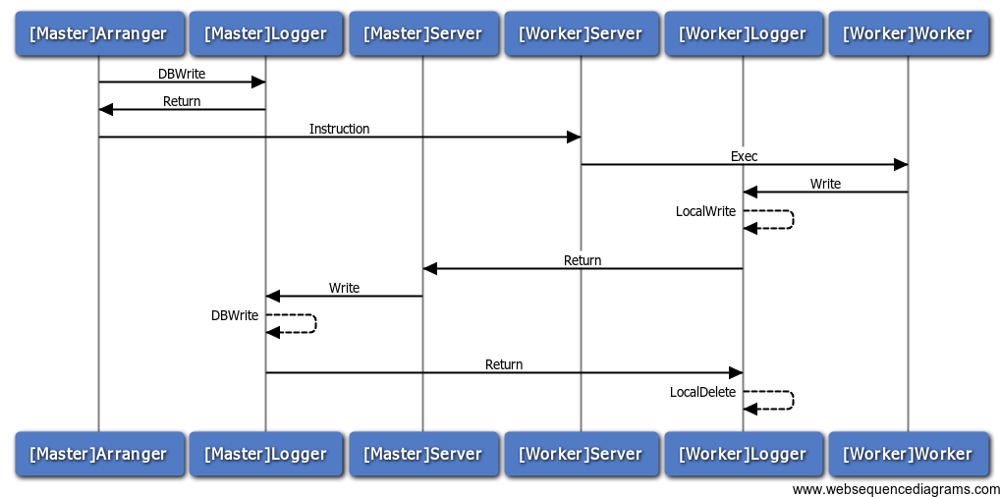

# HighBatch

HighBatch is batch job scheduler sysytem.

HighBatch はバッチ処理をスケジューリングするシステムです。

## できる事と目指すところ

- 簡単なセットアップ
- シンプルな作り
- サーバー毎、タスク毎に実行履歴を表示
- 日時指定起動や間隔指定起動、順番を指定した起動をサポート
- 管理画面からのタスク再実行
- サーバー（Master)とクライアント（Worker）の通信はJSONでのHTTP通信
- 記録のみ用にWebhookでの登録も可能（未実装）
- 正常終了以外の場合にメールで通知（未実装）

## 構成

HighBatchはWorkerを管理するMasterとTaskを実行するWorkerで構成されています。
指定した時間になるとMasterからWorkerにTask起動の指示が出され、指示を出されたWorkerが実行結果をMasterに返答する作りです。

MasterとWorkerは以下のコンポーネントからなる。

- 共通
  - server: MasterとWorker間の通信の制御とユーザーとHighBatchの対話を提供
  - logger: 実行したTaskの結果を管理
  - configer: 設定等を管理

- Master
  - arranger: taskの起動を制御
  - notifier: メール等による通知

- Worker
  - worker: Materからの指示によりTaskを実行

管理サーバーとタスク実行クライアントでは共にHTTPサーバーが起動しており、互いにHTTP通信でタスクの指示や結果の報告が行われる。

## 動作概要

1. Walkerが起動すると1分毎にMasterへデータを送りHTTP経由で生存の確認が行われる
1. Arrangerは生存の確認が出来たWalkerへスケジュールに合わせてHTTP経由でタスク実行を指示
1. 指示を受けたWalkerは外部コマンド起動でタスクを実行し、Logger経由でデータを保存

## 利用しているOSS

- [Golang](https://golang.org/)
- [bolt](https://github.com/boltdb/bolt) (A low-level key/value database for Go.)
- [cron](https://github.com/robfig/cron) (a cron library for go)
- [fsnotify](https://github.com/go-fsnotify/fsnotify) (File system notifications for Go.)
- [Goji](https://github.com/zenazn/goji) (Goji is a minimalistic web framework for Golang that's high in antioxidants.)
- [service](https://github.com/kardianos/service) (Run go programs as a service on major platforms.)
- [toml](https://github.com/BurntSushi/toml) (TOML parser for Golang with reflection.)
- [jQuery](https://jquery.com/)
- [Bootstrap](http://getbootstrap.com/)
- [TreeView](https://github.com/jonmiles/bootstrap-treeview) (Tree View for Twitter Bootstrap)
- [highlight.js](https://highlightjs.org/) (Syntax highlighting for the Web)

