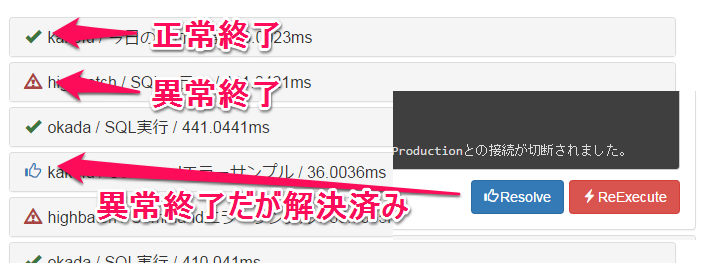

# HighBatch
HighBatch is batch scheduling system. 


https://github.com/nobuhito/HighBatch

---


---

## HighBatchってなに？

---

Golang製のTaskスケジューリングシステム

簡単なセットアップで

*実行したTaskの結果全てをわかりやすく確認できること*

を目指して作成しています

---

運用中のバッチ処理で問題点はありませんか？

---

Windowsのタスクで設定してるけど  
マウスポチポチがめんどくさい...

---

> Windowsのタスクで設定してるけど  
> マウスポチポチがめんどくさい...

それ HighBatch 使えばテキスト編集で制御できるよ

---

機能を使い切れてない。  
ライセンス高いのに...


---

> 機能を使い切れてない。  
> ライセンス高いのに...

それ HighBatch だったらOSSだから  
Freeだし自分で機能追加も出来るよ

---

大げさなシステム過ぎて  
インストールがめんどくさい...  
  
ってか、いまさらJAVAかよ！！

---

> 大げさなシステム過ぎて  
> インストールがめんどくさい...  
>  
> ってか、いまさらJAVAかよ！！

それ HighBatch だったらGoだから  
バイナリ一つコピペすればいいだけだよ

---

HighBatchの機能

- サーバーやタスク毎に実行履歴を表示
- STDOUTとSTDERRORの実行結果を表示
- 異常終了したタスクの手動実行指示
- 異常終了した場合にメールにてアラート
- サーバーを超えたバッチの順次起動

---

を、できるだけ運用が簡単になるように  
Golangでシンプルに作ってみました

---

インスパイア元はSensuとJenkins

というとなんとなくイメージ湧きます？

（かなり低機能ですが...）

---

## 動作概要

---

HighBatchはエージェント方式のクラサバシステムで  
Masterと呼ぶサーバーとWorkerと呼ぶクライアントから構成

MasterもWorkerもWebサーバーが起動しHTTPで相互通信

---

通常Masterは一台で、Workerは複数台

(クライアントに複数Workerを起動させることで  
複数のMasterに分けることもできるはず...）

---

### Master

Taskの指示と実行結果の保存管理を主に担当

*Arranger, Logger, Server, Notifier*

---

### Worker

指示されたTaskを実行し結果をMaterに返答

*Worker, Logger, Server*

---


---

## セッティング

---

### Master

---

```bash
git clone https://github.com/nobuhito/HighBatch.git
cd HighBatch
cp config.toml.sample config.toml
nano config.toml
go get ...
go build main.go
./main
```
※ Unix系の場合

---

config.toml

```toml
[Master]
  Host = "highbatch" # インストールしたMasterのホスト名とポート番号
  Port = "8081"

[Worker]
  Host = "highbatch" # インストールしたMasterのホスト名とポート番号
  Port = "8081"
  LogLevel = 0    # Loglevel 0:自動 1:Info 2:Alert 3:Error
  IsMaster = true # Masterとして稼働させる場合はTrueのまま

[notify.mailInfo]
  # 異常終了のメール設定
  fromAddress = "from@example.com"
  toAddress = ["to@example.com"]
  host = "example.com"
  port = "25"
```

---

下記が表示されたらMasterのインストールは完了


---

### Worker

---

1. ターゲットマシン用にビルドした実行ファイルを  
   任意のフォルダにコピー
1. 設定ファイルがない状態で一度実行
1. 自動でconfig.tomlが作成されるので  
   UTF8を解釈できるエディタで内容を編集
1. ダブルクリックして再度起動

---

config.toml

```toml
[Master]
  Host = "highbatch" # 先にMasterのホスト名とポート番号
  Port = "8081"

[Worker]
  Host = "highbatch" # 自動で設定されるので特に変更の必要なし
  Port = "8081"      # ポートは任意の番号で
  LogLevel = 0       # Loglevel 0:自動 1:Info 2:Alert 3:Error
  IsMaster = false    # WorkerなのでFalseのまま
```

---

下記が表示されたらWorkerのインストールは完了


---

### Windowsだからサービスに登録したい？

---

`command` にできる `win_service_install.bat` を実行して、  
サービス画面で起動させるだけ（管理者権限が必要）

---

### Linux？OSX？

---

daemontoolsとかいろいろあるでしょ？

---

起動後はWorkerが定期的にMasterと通信を開始


---


### Taskの追加

---

TaskはMasterサーバーのTasksフォルダに追加

追加されたTaskは定期的にWorkerへ転送されるのでWorkerへ作成する必要なし

```
Tasks
└─WindowsErrorSample-1
        batch.bat
        spec.toml
```

上記のサンプルではTaskの名前は `WindowsErrorSample-1` になり、 `spec.toml` の定義を元にTaskを実行

---

spec.toml

```
# Taskの概要
description = "Windows batch execute error sample."
# Taskで実行したいコマンドやバッチファイル
cmd = "batch.bat"
# Taskを実行させたいホスト名（複数指定可能）
machine = ["localhost"]
# Taskを実行させたいタイミング（Cron形式で指定）
schedule = "0 0 * * * *"
```

spec.tomlは必須ファイル(UTF8)

---

spec.tomlでは以下の内容を設定可能

項目名      | 内容
------------|----
description |  タスクの概要
cmd         | 実行したいコマンド
schedule    | 実行したいタイミング(cron形式)
chain       | 次に実行したいタスクの名前
error       | 異常終了と判定したい正規表現
onErrorStop | 異常終了時は次のタスクを実行しない

---

実行時はこのフォルダをカレントとして実行されるので  
バッチファイル等の指定はここからの相対パスで指定する

---

### 管理画面

---

全バッチの履歴一覧とWorker/Task/Errorのツリー表示


---

履歴一覧を開くと実行結果を表示


---

Taskに関連するファイルを表示


---

### いろいろ細かい部分など

---

リスト表示のマーク



---

Treeビュー


---

結果表示1


---

結果表示2


---

結果表示3


---

実行中


---

足りない機能があったら教えて下さい

https://github.com/nobuhito/HighBatch/issues

https://gitter.im/nobuhito/HighBatch

---

それでは、よいバッチ管理ライフを！

<s> 異常 </s> 以上

---

あっ、ロゴも募集中です。

Batch → バッチ → バチ → 火鉢 → Hibati → HighBatch

なので、熱そうな *火鉢* をロゴに出来たら嬉しいです...
